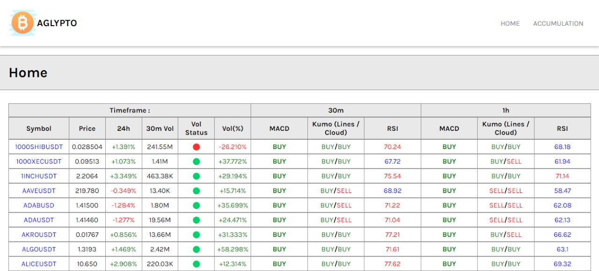
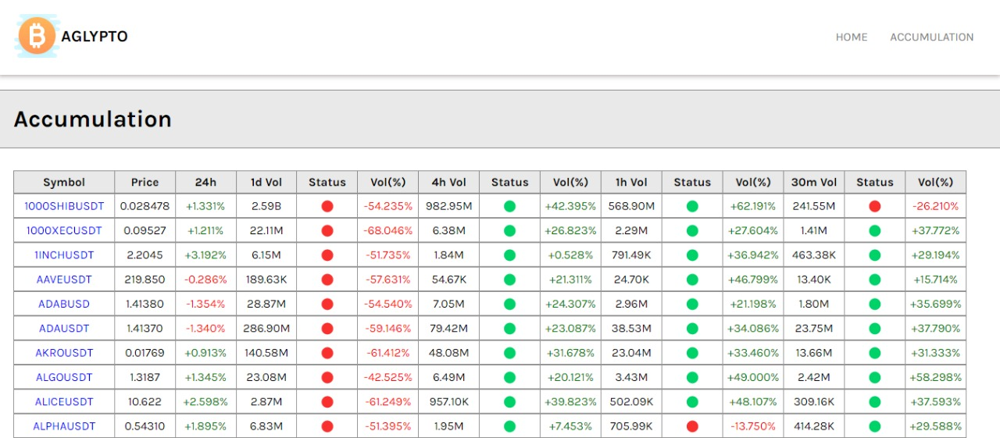
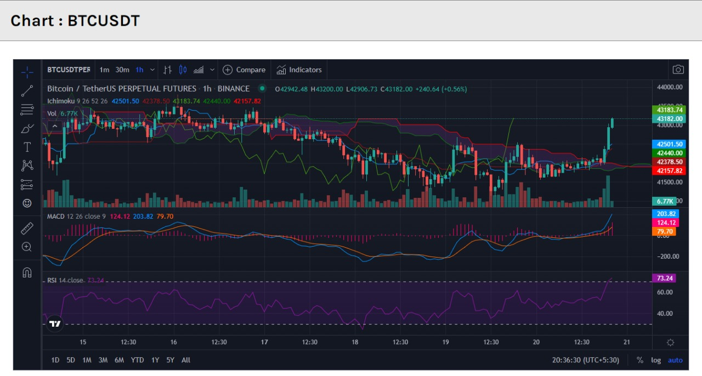

# Aglypto for Binance Futures

Binance Futures Trading Dashboard that provides live websocket market data and calculates MACD, ICHIMOKU and RSI and Volume accumulation per timeframe.

## Screenshots

### Home Page



### Accumulations Page



### Charts Page



# Home Page

Home Page contains the details about MACD, Ichimoku and RSI signals (Buy or sell)

# Accumulation Page

Accumulation Page contains the accumulation (buying) data, It compares the previous candle's accumulation data and shows how much percentage it changed. Accumulation is an important factor in determining the market movement.

# Charts Page

It displays the chart of the current symbol from TradingView.

# How to use

This site is deployed in heroku [Live Site Link](https://aglypto.herokuapp.com)

## How to run locally

```bash
$ git clone https://github.com/rishikesh2003/Aglypto.git

$ cd Aglypto

$ npm install

$ npm start
```
